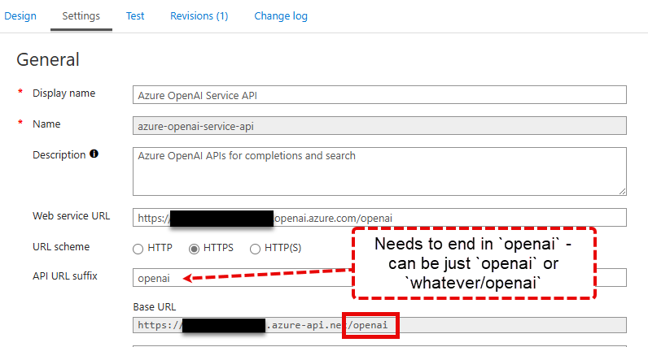

# demo-langchain-apim
Demo calling Azure OpenAI with [LangChain](https://python.langchain.com/docs/get_started/introduction) via Azure API Management (APIM).

_Update: Now includes an example using the [OpenAI SDK](https://pypi.org/project/openai/): [`apim-aoai-sdk.py`](apim-aoai-sdk.py)_

## Azure Environment

Your APIM will need to have Azure OpenAI REST API methods implemented (import OpenAPI spec from [docs](https://learn.microsoft.com/en-us/azure/ai-services/openai/reference)).

On your API, rename the subscription key header paramenter to `api-key`. Create an [APIM subscription](https://learn.microsoft.com/en-us/azure/api-management/api-management-subscriptions) with access to the APIs.

### APIM API Configuration

Note that "Open AI" endpoints are expected to end with `/openai` after the endpoint base URL (`AZURE_OPENAI_ENDPOINT`). When configuring your API in APIM Management, set the `API URL Suffix` to end with `/openai`, either just by setting it to `openai` or `something-else/openai`.



## Running the Sample

To run this sample, rename `.env.sample` to `.env` and populate the values for:

- `AZURE_OPENAI_API_KEY`: Your APIM subscription key
- `AZURE_OPENAI_ENDPOINT`: The URL to your APIM OpenAI APIs

### Samples Available

- `apim.py`: Calling the chat completions API from LangChain
- `apim.http`: Calling the chat completions API directly with HTTP
  - Here you can see the `X-MS-Region` response header which indicates the Azure region used by Azure OpenAI.
  - Uses the [VS Code REST Client](https://marketplace.visualstudio.com/items?itemName=humao.rest-client) extension.

## Other Resources

Example of APIM policy to load balance AOAI across multiple regions/deployments: https://gist.github.com/ChrisRomp/f038cc233d99eaf578065723bade2a26

Load Balancing AOAI via APIM: https://github.com/ian-t-adams/azure-openai-api-m-retry -- _This example walks through configuring APIM in Azure as well._

Active/Passive load balancing with APIM: https://techcommunity.microsoft.com/t5/fasttrack-for-azure/smart-load-balancing-for-openai-endpoints-and-azure-api/ba-p/3991616

## Troubleshooting

The Python debugger should provide reasonable output to diagnose issues, however you may also wish to enable [diagnostic logging](https://learn.microsoft.com/en-us/azure/api-management/diagnostic-logs-reference) in Azure API Management and configure it to emit Gateway logs to Azure Log Analytics or another option.

In Log Analytics, you can see APIM Gateway log messages including errors for bad requests using a query like:

```kusto
ApiManagementGatewayLogs
| order by TimeGenerated desc
```

Or filter to failed requests with:

```kusto
ApiManagementGatewayLogs
| where not(IsRequestSuccess)
| order by TimeGenerated desc
```
